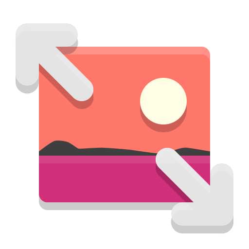
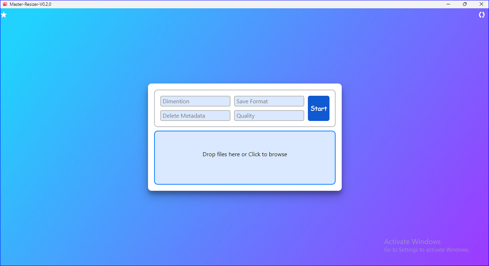
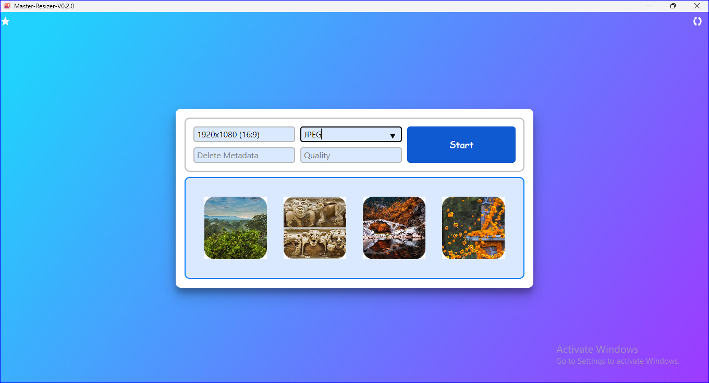
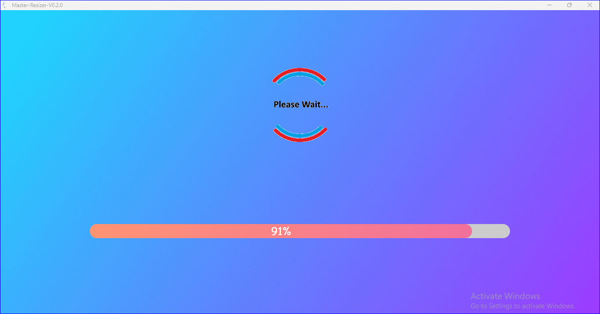
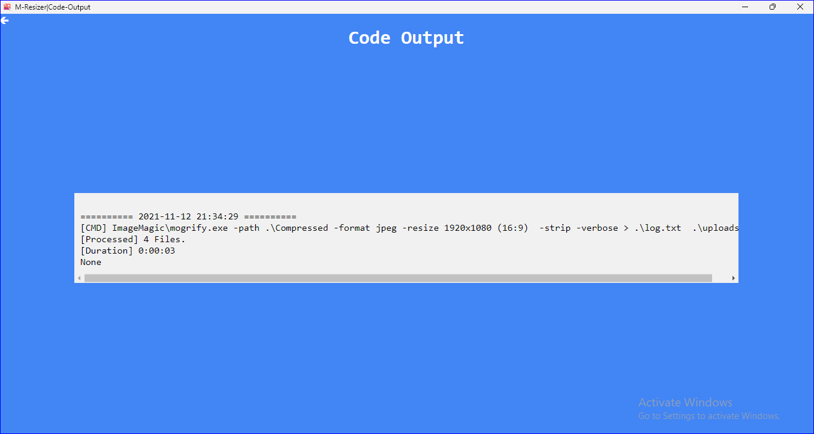
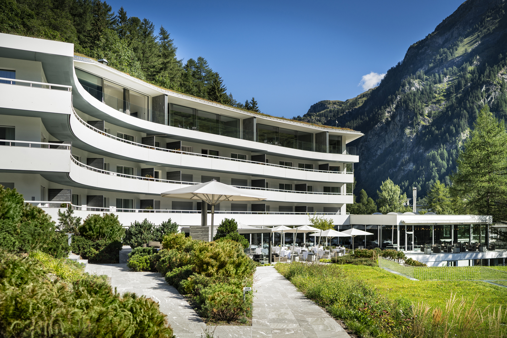

<h1 align="center">MASTER IMAGE RESIZER</h1>

<b>All in one image resizer, optimizer(compressor) and converter</b>

    
    
    
    
    
    

 

Made With
---

 

Index
---
- [About](#about)
- [Installation](#installation)
- [Screen Shots](#screen-shots)
- [Examples](#examples)
- [Best Settings](#best-settings)

 

[:arrow_up:](#index) About
---
- For Image processing it uses [Image-Magick-v7.1.0](https://github.com/ImageMagick/ImageMagick)
- Front-End made with HTML, CSS and JS
- Application made using [Python-Flask](https://flask.palletsprojects.com/en/2.0.x/) wrapped in [Flask-Web-GUI-v0.3.3](https://pypi.org/project/flaskwebgui/0.3.3/)
- Exe made with [Auto-py-to-exe](https://pypi.org/project/auto-py-to-exe/)
- Supports Stats and Logging to a file.
- Source Code comming soon!

 

[:arrow_up:](#index) Installation
---
> Download the [Master-Image-Resizer.v1.0.0.rar](https://github.com/vivekkushalch/Master-IMG-Resizer/releases/tag/v1.0.0) then extract it and run the Master-Resizer.exe.

 

[:arrow_up:](#index) Screen Shots
---
 | 
:-------------------------:|:-------------------------:
 | 

 

[:arrow_up:](#index) Examples
---
Original            |  Processed 
:-------------------------:|:-------------------------:
  | 
**8.11 MB (Original)**   (3776 x 2519)  | **3.11 MB** `(quality 92)` (-5MB)   (3776 x 2519)
  | 
**1.94 MB** `(dimention 1920x1080)` (-6.17MB)   (1920x1080)  |  **832 KB** `(d 1920x1080) & (q 92)` (-7.27MB)   (1920x1080)

 

[:arrow_up:](#index) Best Settings
---

- **For Best loss-less compression**
> **`dimentions to Original` and `quality > 92`**

- **For Auto Image Optimisation(compression)**
> **`dimention to Original` and `quality to 0`**

- **NOTE** 
> **For best image quality use either `dimention` or `quality` setting at one time or use  the combination of `dimention` and `quality > 92` else you will start loosing `image colours`.**
>>**To open `/Compressed folder` click on the notification after image processing.**

 

[:arrow_up:](#index) License 
-------
**The MIT License (MIT)**

A short and simple permissive license with conditions only requiring preservation of copyright and license notices. Licensed works, modifications, and larger works may be distributed under different terms and without source code.

-------
_Made with :heart: in India by [Vivek Kushal Chakraborty](https://github.com/vivekkushalch)._
